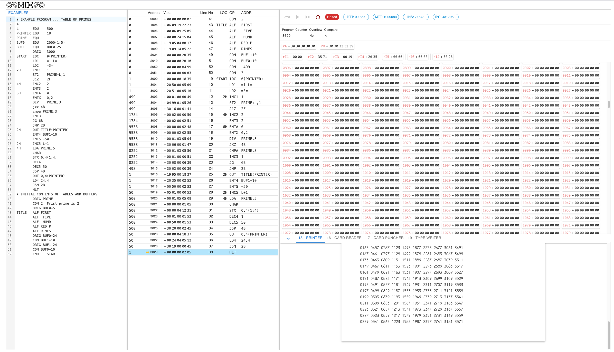
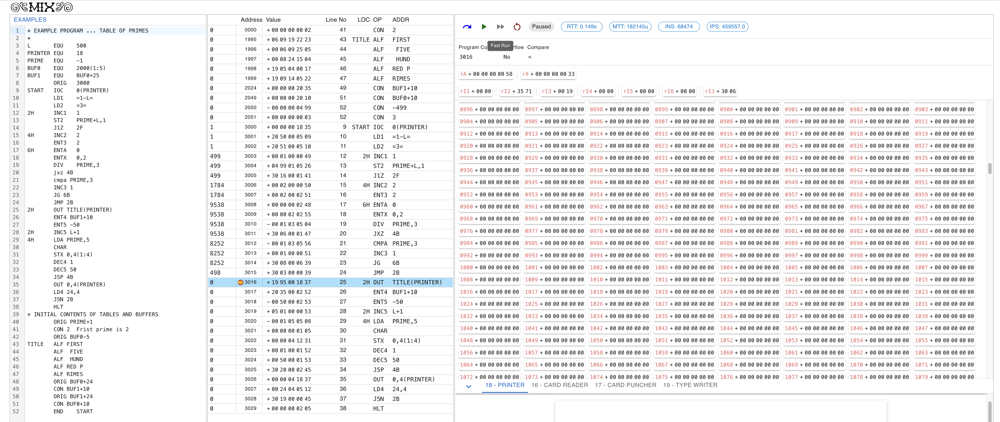
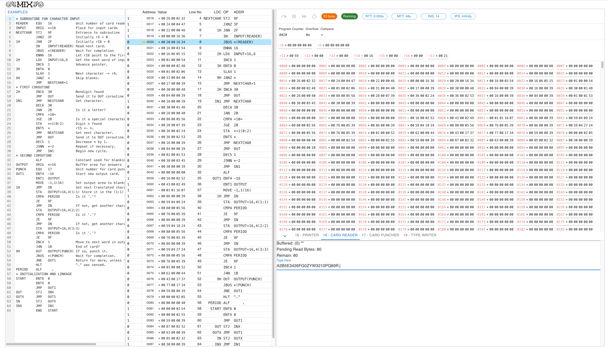

A MIX IDE that runs in web browsers.

Hosted: TODO

## Examples

### Print first 500 primes (from Vol1 1.3.2 The MIX Assembly Language)

### Break point

### Waiting user input

## Why writing a MIX emulator?

Because it's fun! And I needed an environment to write MIX assembly programs.

And it would be nice if I can debug the program, too.

## What about MMIX?

Yes, I know, MIX was deprecated. Self-modifying code are ANCIENT. No modern OS allows you to modify the code segment. Even the [MMIX Supplement book](https://www.amazon.com/dp/0133992314) was published almost 10 years ago, which means all the programs in vol1-3 are converted to MMIX.

But I haven't bought that book, so I'm working with what I have. Lots of interesting MIX programs exist in the three volumes.

And I will make a MMIX emulator that runs in browsers, which will have lots of interesting problems. I expect it would be much harder than running a grandpa computer from the 1960s. 

I mean, honestly, the whole MIX machine has 4000 "words", where each "word" can represent $2^{31}$ different values.

Let's say each word corresponds to 4 8-bit bytes, MIX has only 16k bytes of memory!

## Other MIX Emulators

Top results by googling "MIX knuth simulator";

- https://www.mix-emulator.org/
  A similar web-based MIX emulator with a program editor, MIX assembler and a machine view where you can run/step through the compiled code.
  
- https://github.com/gtryf/MIXWare
  CLI based assembler and simulator written in C#, potentially it can be compiled on platforms other than Windows, but I didn't try.

- [GNU MDK](https://www.gnu.org/software/mdk/)
  Tbh I'm a bit surprised this one is still alive, I used it about 20 years ago. It's a pretty decent IDE for MIX programming.
  P.S. I'm just checking the project page and it even got a UI upgrade!

- https://sourceforge.net/projects/mixide/ Written in Java.
